# Design and Implementation of Variable Gain Amplifier (VGA)

A **Variable Gain Amplifier (VGA)** designed and implemented using **Cadence Virtuoso** on **180 nm CMOS technology**. The project demonstrates the complete analog IC design flow from circuit design to post-layout verification.

---

# Project Overview

Variable Gain Amplifiers (VGAs) are fundamental analog building blocks used in communication systems, automatic gain control (AGC), radar, ultrasound imaging, and audio processing. Unlike fixed-gain amplifiers, a VGA provides adjustable gain by varying a control voltage.

In this work, the gain is controlled through the bias voltage of the tail current source in a differential amplifier architecture. The project covers the complete custom IC design methodology including schematic design, layout implementation, physical verification, parasitic extraction, and post-layout simulations.

---

# Design Flow

```
Specification
      │
      ▼
Circuit Design
      │
      ▼
Symbol Creation
      │
      ▼
Testbench Development
      │
      ▼
Circuit Simulation
      │
      ▼
Layout Design
      │
      ▼
DRC Verification
      │
      ▼
LVS Verification
      │
      ▼
RC Extraction
      │
      ▼
Monte Carlo Analysis
      │
      ▼
Post-Layout Simulation
```

---

# Circuit Architecture

The Variable Gain Amplifier is implemented using a differential amplifier topology consisting of:

- Differential NMOS input pair
- PMOS active load
- Tail current source
- Differential output stage

The amplifier gain is varied by controlling the tail current through the bias voltage applied to the current source transistor.

<p align="center">
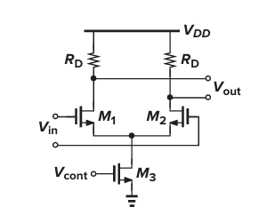
</p>

---

# Schematic Design

The complete transistor-level schematic was implemented in Cadence Virtuoso using the 180 nm CMOS process. Proper transistor sizing and biasing were selected to achieve variable gain operation.

<p align="center">
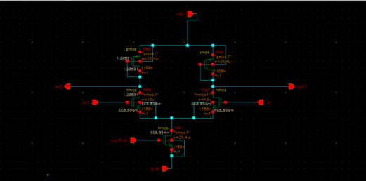
</p>

---

# Symbol Creation

A reusable symbol was generated from the schematic to simplify higher-level integration and simulation. The symbol exposes only the required input, output, supply, and control terminals.

<p align="center">
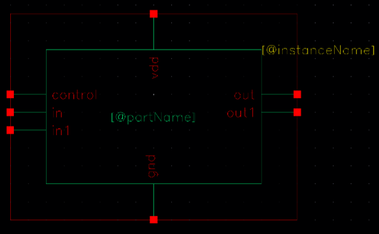
</p>

---

# Testbench Development

A dedicated testbench was created to provide supply voltages, differential input signals, and control bias voltages for functional verification of the amplifier.

<p align="center">
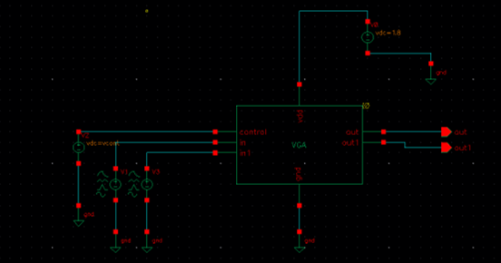
</p>

---

# Layout Design

Following successful schematic verification, the physical layout of the VGA was implemented in Cadence Virtuoso while following the design rules of the 180 nm CMOS technology.

The layout includes:

- Differential pair
- Active loads
- Tail current source
- Metal routing
- Device matching considerations

<p align="center">
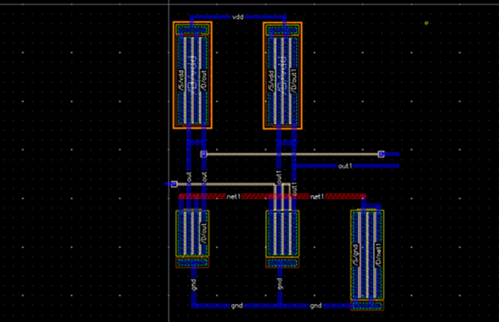
</p>

---

# Design Rule Check (DRC)

During layout development, several physical design rule violations such as minimum metal width, minimum metal spacing, via enclosure, contact enclosure, minimum area, and notch width violations were identified and resolved through iterative layout optimization. The final layout successfully passed all Design Rule Checks (DRC).

<p align="center">
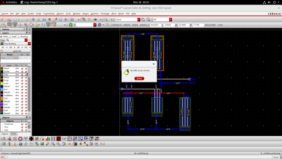
</p>

---

# Layout Versus Schematic (LVS)

The completed layout was verified using Layout Versus Schematic (LVS) to ensure that the fabricated layout accurately represented the intended circuit schematic. During verification, connectivity-related mismatches such as net mismatches, pin mismatches, missing connections, and device connectivity inconsistencies were identified and corrected. After iterative debugging and layout refinement, the design successfully achieved LVS-clean status, confirming that the extracted layout netlist matched the original schematic.

<p align="center">
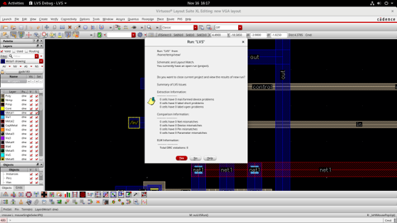
</p>

---

# RC Extraction

Parasitic resistance and capacitance introduced by interconnects were extracted from the layout. The extracted view was subsequently used for post-layout simulations to account for non-ideal effects.

<p align="center">
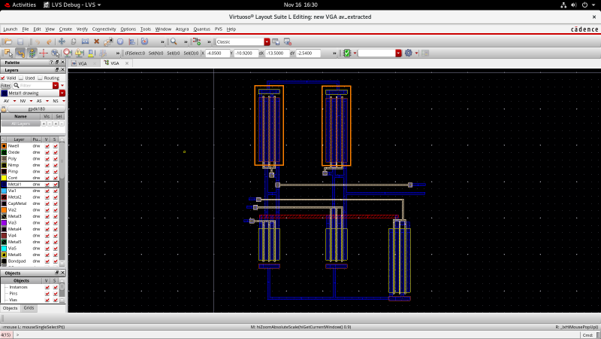
</p>

---

# Monte Carlo Analysis

Monte Carlo simulations were carried out to evaluate the robustness of the design against statistical process variations and device mismatches.

<p align="center">
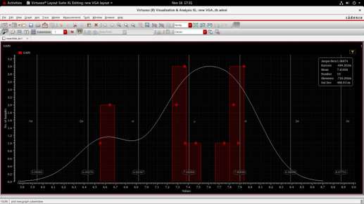
</p>

---

# Pre-Layout Simulations

Before layout implementation, AC and transient simulations were performed to verify the functionality of the designed amplifier.

### AC Analysis

<p align="center">
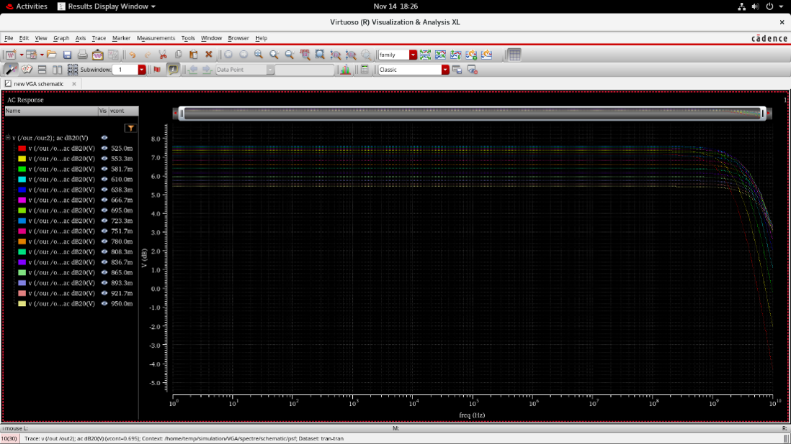
</p>

### Transient Analysis

<p align="center">
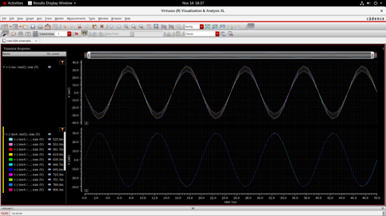
</p>

---

# Post-Layout Simulations

After RC extraction, post-layout simulations were performed using the extracted netlist to observe the circuit behavior including parasitic effects.

<p align="center">
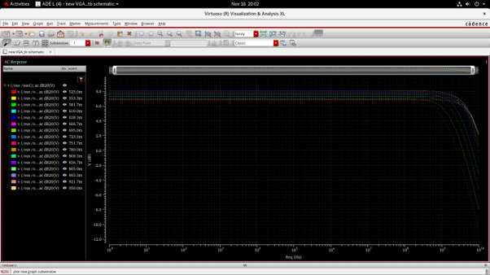
</p>

---

# Design Tools

- Cadence Virtuoso
- Spectre Simulator
- CMOS 180 nm Technology

---

# Repository Structure

```
.
├── docs
│   └── images
│       ├── VGA_diagram.png
│       ├── Schematic.png
│       ├── symbol.png
│       ├── tb.png
│       ├── Layout.png
│       ├── DRC.png
│       ├── LVS.png
│       ├── RCX.png
│       ├── Monte_carlo.png
│       ├── pre_layout_ac.png
│       ├── pre_layout_trans.png
│       └── post_layout_ac.png
└── README.md
```

---

# Author

**Ishan Upadhye**

M.Tech in VLSI Design  

